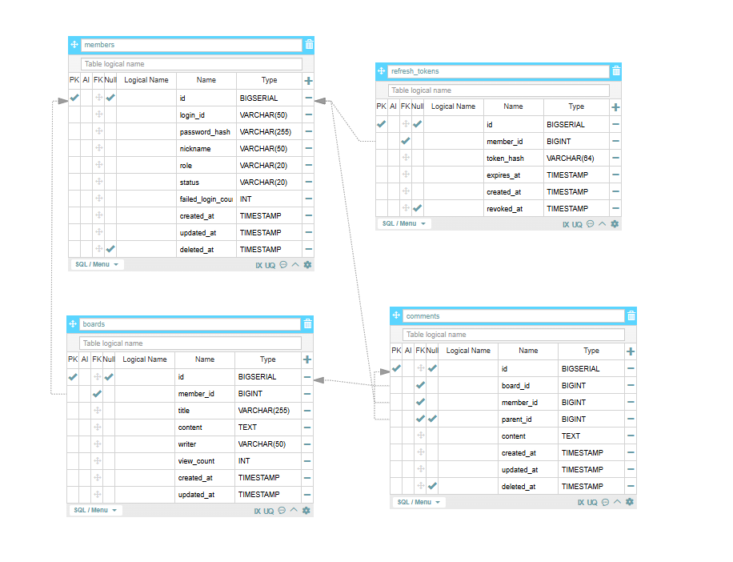

# 스프링 부트 게시판 프로젝트 — 발표 문서

> **역량 평가용 정리본**  
> 구현 내용 설명 + 선임에게 받을 수 있는 질문 + 알면 좋은 핵심 개념

---

## 목차

1. [프로젝트 개요](#1-프로젝트-개요)
2. [기술 스택](#2-기술-스택)
3. [패키지 구조 & 아키텍처](#3-패키지-구조--아키텍처)
4. [DB 설계](#4-db-설계)
5. [인증 & 보안 (JWT + Spring Security)](#5-인증--보안-jwt--spring-security)
6. [구현 기능 상세](#6-구현-기능-상세)
7. [API 명세](#7-api-명세)
8. [프론트엔드 구조](#8-프론트엔드-구조)
9. [핵심 설계 결정 & 이유](#9-핵심-설계-결정--이유)
10. [알면 좋은 개념 정리](#10-알면-좋은-개념-정리)
11. [선임이 물어볼 수 있는 질문 & 답변](#11-선임이-물어볼-수-있는-질문--답변)

---

## 1. 프로젝트 개요

**JWT 인증 기반 풀스택 게시판 애플리케이션**

| 항목 | 내용 |
|------|------|
| 목적 | 회원가입/로그인부터 게시글 CRUD, 댓글(대댓글), 이미지 업로드까지 갖춘 게시판 |
| 인증 방식 | JWT Access Token + Refresh Token (토큰 로테이션, DB 저장) |
| 백엔드 | Spring Boot 3 + MyBatis + PostgreSQL |
| 프론트엔드 | React 18 + TypeScript + Toast UI Editor |

### 구현된 기능 요약

- **회원**: 가입 / 로그인 / 내 정보 조회 / 닉네임 수정 / 비밀번호 변경 / 탈퇴
- **게시글**: 목록(페이징) / 검색(제목·내용·작성자·전체) / 인기글 / 상세 조회(조회수++) / 작성 / 수정 / 삭제
- **댓글**: 작성 / 수정 / 소프트 삭제 / 대댓글(1단계)
- **이미지**: 업로드 / 자동 삭제(게시글 삭제 시)

---

## 2. 기술 스택

### 백엔드

| 기술 | 버전 | 역할 |
|------|------|------|
| Spring Boot | 3.5.0 | 애플리케이션 프레임워크 |
| Java | 17 | 언어 |
| Spring Security | (Boot 내장) | 인증/인가 처리 |
| MyBatis | (Boot Starter) | SQL 매퍼 ORM |
| PostgreSQL | - | 관계형 DB |
| JJWT | 0.12.6 | JWT 생성/검증 |
| Lombok | - | 보일러플레이트 코드 제거 |

### 프론트엔드

| 기술 | 역할 |
|------|------|
| React 18 + TypeScript | UI 프레임워크 |
| Vite | 빌드 도구 |
| React Router | 클라이언트 사이드 라우팅 |
| Axios | HTTP 클라이언트 |
| Toast UI Editor | 리치 텍스트(마크다운) 에디터 |

---

## 3. 패키지 구조 & 아키텍처

### 백엔드 패키지 구조

```
com.board.backend
├── board/
│   ├── controller/    BoardController.java
│   ├── service/       BoardService (interface) + BoardServiceImpl
│   ├── mapper/        BoardMapper (MyBatis 인터페이스)
│   ├── domain/        Board.java (엔티티)
│   ├── dto/           BoardCreateRequest, BoardUpdateRequest, BoardResponse
│   └── exception/     BoardNotFoundException, BoardCreateFailedException, ...
│
├── member/
│   ├── controller/    MemberController.java
│   ├── service/       MemberService (interface) + MemberServiceImpl
│   ├── mapper/        MemberMapper, RefreshTokenMapper
│   ├── domain/        Member.java, RefreshToken.java
│   └── dto/           MemberLoginRequest, MemberLoginResponse, RefreshTokenRequest, ...
├── comment/
│   ├── controller/    CommentController.java
│   ├── service/       CommentService (interface) + CommentServiceImpl
│   ├── mapper/        CommentMapper (MyBatis 인터페이스)
│   ├── domain/        Comment.java (엔티티)
│   ├── dto/           CommentCreateRequest, CommentUpdateRequest, CommentResponse
│   └── exception/     CommentNotFoundException, CommentCreateFailedException, ...
├── image/
│   ├── controller/    ImageController.java
│   └── service/       ImageService.java
│
└── global/
    ├── config/        SecurityConfig, WebConfig
    ├── security/      JwtTokenProvider, JwtAuthenticationFilter, LoginMember, TokenHashUtil
    ├── common/        PageResponse
    └── exception/     GlobalExceptionHandler, ErrorResponse
```

### 아키텍처: 레이어드 아키텍처

```
[Client]
    ↓ HTTP 요청
[JwtAuthenticationFilter]   ← 모든 요청에 대해 JWT 검증 먼저 수행
    ↓
[Controller]   ← 요청 받기, 응답 내보내기 (비즈니스 로직 없음)
    ↓
[Service]      ← 비즈니스 로직, 소유자 검증, 예외 처리
    ↓
[Mapper]       ← SQL 실행 (MyBatis XML과 연동)
    ↓
[PostgreSQL]
```

**도메인별 패키지 분리**: board / member / comment / image를 각각 독립된 패키지로 나눠 관심사를 분리했습니다.

### 인터페이스 & 구현체 분리

```java
// 추상화
public interface BoardService { ... }

// 실제 구현
@Service
public class BoardServiceImpl implements BoardService { ... }
```

이 패턴의 이유: 나중에 구현체를 교체하거나 테스트에서 목(Mock)으로 대체하기 쉬워집니다.

---

## 4. DB 설계



### ERD (관계 요약)

```
members (1) ──< boards (N)
members (1) ──< refresh_tokens (N)
boards  (1) ──< comments (N)
comments (1) ──< comments (N)   ← self-referencing (대댓글)
```

### 테이블 상세

#### members

| 컬럼 | 타입 | 설명 |
|------|------|------|
| id | BIGSERIAL PK | 자동 증가 ID |
| login_id | VARCHAR(50) UNIQUE | 로그인 아이디 |
| password_hash | VARCHAR(255) | 암호화된 비밀번호 |
| nickname | VARCHAR(50) UNIQUE | 닉네임 |
| role | VARCHAR(20) DEFAULT 'USER' | 권한 |
| status | VARCHAR(20) DEFAULT 'ACTIVE' | 활성/탈퇴 상태 |
| failed_login_count | INT | 로그인 실패 횟수 |
| deleted_at | TIMESTAMP NULL | 소프트 삭제 시간 |

#### boards

| 컬럼 | 타입 | 설명 |
|------|------|------|
| id | BIGSERIAL PK | - |
| member_id | BIGINT FK | 작성자 (members.id 참조) |
| title | VARCHAR | 제목 |
| content | TEXT | 내용 (마크다운 HTML) |
| writer | VARCHAR | 작성자 닉네임 스냅샷 |
| view_count | INT | 조회수 |

#### refresh_tokens

| 컬럼 | 타입 | 설명 |
|------|------|------|
| id | BIGSERIAL PK | - |
| member_id | BIGINT FK | 회원 (members.id, CASCADE DELETE) |
| token_hash | VARCHAR(64) UNIQUE | Refresh Token의 SHA-256 해시 (원본 저장 안 함) |
| expires_at | TIMESTAMP | 만료 시간 |
| created_at | TIMESTAMP | 발급 시간 |
| revoked_at | TIMESTAMP NULL | 폐기 시간 (NULL이면 유효) |

```sql
CREATE INDEX idx_refresh_tokens_member_id ON refresh_tokens(member_id);
CREATE INDEX idx_refresh_tokens_token_hash ON refresh_tokens(token_hash);
```

#### comments

| 컬럼 | 타입 | 설명 |
|------|------|------|
| id | BIGSERIAL PK | - |
| board_id | BIGINT FK | 게시글 |
| member_id | BIGINT FK | 작성자 |
| parent_id | BIGINT FK NULL | NULL이면 루트 댓글, 값이 있으면 대댓글 |
| content | TEXT | 내용 |
| deleted_at | TIMESTAMP NULL | 소프트 삭제 |

#### 인덱스 설계

```sql
CREATE INDEX idx_comments_board_id ON comments(board_id);
CREATE INDEX idx_comments_parent_id ON comments(parent_id);
CREATE INDEX idx_comments_board_parent_created
    ON comments(board_id, parent_id, created_at);   -- 복합 인덱스: 댓글 정렬 쿼리 최적화
```

### 핵심 설계 결정

**writer 컬럼 (탈퇴 회원 폴백)**  
조회 시 `COALESCE(m.nickname, b.writer)`로 현재 닉네임을 우선 표시합니다. 닉네임을 변경하면 기존 게시글에도 변경된 닉네임이 반영됩니다. `b.writer`(작성 당시 스냅샷)는 회원 탈퇴로 members 레코드가 없을 때만 폴백으로 사용됩니다.

**소프트 삭제 vs 하드 삭제**
- 댓글: `deleted_at` 타임스탬프로 소프트 삭제 → "삭제된 댓글입니다." 표시, 스레드 구조 유지
- 게시글: 하드 삭제 (연관 이미지 파일도 함께 삭제)
- 회원: `status = WITHDRAWN`으로 소프트 삭제

---

## 5. 인증 & 보안 (JWT + Refresh Token + Spring Security)

### 전체 인증 흐름

```
[로그인]
클라이언트 → POST /api/members/login (loginId + password)
         ← 200 OK { accessToken: "eyJ...(1시간)", refreshToken: "eyJ...(7일)" }
             └─ refreshToken은 SHA-256 해시로 DB(refresh_tokens)에도 저장

[API 요청]
클라이언트 → GET /api/members/me
             Authorization: Bearer {accessToken}
         ← JwtAuthenticationFilter: 서명 + 만료 + tokenType 검증
         ← SecurityContext에 LoginMember 저장
         ← Controller에서 @AuthenticationPrincipal LoginMember 사용

[Access Token 만료 시 재발급]
클라이언트 → POST /api/members/refresh { refreshToken: "eyJ..." }
         ← 서버: JWT 서명/만료 검증 → SHA-256 해시 → DB 조회 (유효+미폐기)
         ← 기존 refresh_token 폐기 (revokedAt 설정) → 새 토큰 쌍 발급
         ← 200 OK { accessToken: "eyJ...(새 1시간)", refreshToken: "eyJ...(새 7일)" }

[로그아웃]
클라이언트 → POST /api/members/logout { refreshToken: "eyJ..." }
         ← 서버: SHA-256 해시 → DB에서 해당 토큰 폐기 (revokedAt 설정)
         ← 200 OK  (이후 해당 refreshToken으로 재발급 불가)
```

### JWT 토큰 구조 (두 종류)

```
Header.Payload.Signature

[Access Token Payload]
{
  "sub": "1",              ← memberId
  "tokenType": "access",  ← 타입 구분 (access/refresh 혼용 방지)
  "loginId": "user01",
  "role": "USER",
  "iat": 1234567890,
  "exp": 1234571490        ← 1시간 후
}

[Refresh Token Payload]
{
  "sub": "1",              ← memberId만 포함
  "tokenType": "refresh",
  "iat": 1234567890,
  "exp": 1235172290        ← 7일 후
}
```

**tokenType 클레임 이유**: Access Token으로 재발급 API를 호출하거나, Refresh Token으로 API를 인증하는 혼용 공격을 방지합니다.

### Refresh Token DB 저장 & 해시

Refresh Token은 원문이 아닌 **SHA-256 해시값**만 DB에 저장합니다.

```java
// TokenHashUtil.java
public static String sha256(String token) {
    MessageDigest digest = MessageDigest.getInstance("SHA-256");
    byte[] hash = digest.digest(token.getBytes(StandardCharsets.UTF_8));
    // hex 문자열로 변환해 반환
}

// 저장 시
refreshTokenMapper.save(memberId, TokenHashUtil.sha256(refreshToken), expiresAt);

// 검증 시
RefreshToken saved = refreshTokenMapper.findValidByTokenHash(
    TokenHashUtil.sha256(incomingToken), LocalDateTime.now()
);
```

DB가 탈취되더라도 원본 Refresh Token을 복원할 수 없습니다.

### 토큰 로테이션 (Token Rotation)

재발급 시마다 기존 Refresh Token을 폐기하고 새 토큰을 발급합니다.

```java
// refresh() 메서드
refreshTokenMapper.revokeByTokenHash(tokenHash);  // 기존 폐기
return issueTokens(member);                        // 새 쌍 발급
```

효과: Refresh Token이 탈취돼도 한 번 사용되면 무효화됩니다. 피해자가 재발급하면 공격자 토큰이 폐기됩니다.

### JwtAuthenticationFilter 동작 원리

```java
// 1. Authorization 헤더에서 토큰 추출
String token = resolveToken(request);  // "Bearer eyJ..." → "eyJ..."

// 2. 서명 + 만료 시간 + tokenType="access" 검증
jwtTokenProvider.validateToken(token);

// 3. 토큰 클레임에서 사용자 정보 추출
LoginMember loginMember = jwtTokenProvider.getLoginMember(token);

// 4. SecurityContext에 인증 정보 저장
SecurityContextHolder.getContext().setAuthentication(
    new UsernamePasswordAuthenticationToken(loginMember, null, authorities)
);
```

### SecurityConfig 공개/보호 엔드포인트

```
공개 (인증 불필요):
  POST /api/members/signup
  POST /api/members/login
  POST /api/members/refresh
  GET  /api/boards/**
  /uploads/**

보호 (Access Token 필요):
  POST /api/boards
  PUT  /api/boards/{id}
  DELETE /api/boards/{id}
  GET/PATCH/DELETE /api/members/me
  POST /api/members/logout
  POST /api/boards/{id}/comments
  ...
```

### 비밀번호 보안

`DelegatingPasswordEncoder` 사용 → BCrypt로 해싱  
평문 비밀번호는 DB에 절대 저장되지 않습니다.

---

## 6. 구현 기능 상세

### 6-1. 게시판 CRUD

**목록 조회 (페이지네이션)**
```
GET /api/boards?page=1&size=10

응답:
{
  "data": [ { id, title, writer, viewCount, createdAt }, ... ],
  "page": 1,
  "size": 10,
  "totalCount": 53,
  "totalPages": 6
}
```

SQL 페이지네이션:
```sql
SELECT * FROM boards
ORDER BY created_at DESC
LIMIT #{size} OFFSET #{offset}   -- offset = (page-1) * size
```

**검색 (MyBatis 동적 SQL)**

`searchType` 파라미터로 검색 대상을 선택하고, `keyword`로 검색합니다.

```
GET /api/boards?searchType=title&keyword=스프링
GET /api/boards?searchType=content&keyword=jwt
GET /api/boards?searchType=writer&keyword=홍길동
GET /api/boards?searchType=all&keyword=게시판   ← 기본값 (제목+내용+작성자 모두 검색)
```

MyBatis `<choose>/<when>/<otherwise>`로 searchType에 따라 WHERE 절을 동적으로 생성합니다.  
PostgreSQL의 `ILIKE`를 사용해 대소문자를 구분하지 않고 검색합니다.

```xml
<where>
  <if test="keyword != null and keyword != ''">
    <choose>
      <when test="searchType == 'title'">
        b.title ILIKE CONCAT('%', #{keyword}, '%')
      </when>
      <when test="searchType == 'writer'">
        COALESCE(m.nickname, b.writer) ILIKE CONCAT('%', #{keyword}, '%')
      </when>
      <otherwise>   <!-- all: 제목 OR 내용 OR 작성자 -->
        (b.title ILIKE ... OR b.content ILIKE ... OR COALESCE(m.nickname, b.writer) ILIKE ...)
      </otherwise>
    </choose>
  </if>
</where>
```

keyword가 빈 문자열이면 `<where>` 절이 통째로 생략되어 전체 목록을 반환합니다.

**인기글**

```
GET /api/boards/popular?limit=5
```

조회수 내림차순, 동점이면 최신순으로 상위 N개를 반환합니다.

```sql
ORDER BY b.view_count DESC, b.id DESC
LIMIT #{limit}
```

**조회수 증가**  
상세 조회 시 `UPDATE boards SET view_count = view_count + 1` 실행.

**소유자 검증**  
수정/삭제 시 `board.getMemberId().equals(loginMember.getId())` 확인.  
일치하지 않으면 `AccessDeniedException` → 403 응답.

### 6-2. 댓글 & 대댓글

**구조**: Self-Referencing 테이블

```
댓글 A (parent_id = NULL)
  └── 대댓글 A-1 (parent_id = A.id)
  └── 대댓글 A-2 (parent_id = A.id)
댓글 B (parent_id = NULL)
```

**대댓글 제한 로직**
```java
// 대댓글에는 답글을 달 수 없음 (1단계만 허용)
if (parent.getParentId() != null) {
    throw new IllegalArgumentException("대댓글에는 답글을 작성할 수 없습니다.");
}
```

**소프트 삭제**  
`deleted_at` 설정 + 프론트에서 "삭제된 댓글입니다." 표시  
→ 대댓글이 있어도 스레드 구조가 깨지지 않음

### 6-3. 이미지 업로드

**흐름**:
1. 에디터에서 이미지 삽입 → 브라우저 임시 Blob URL 생성
2. 게시글 저장 시 Blob URL들을 서버에 업로드 (`POST /api/images`)
3. 서버: UUID 파일명으로 로컬 디스크에 저장, `/uploads/uuid.ext` URL 반환
4. 본문의 Blob URL을 영구 URL로 교체 후 게시글 저장

**게시글 삭제 시 이미지 정리**:
```java
// 본문에서 /uploads/ 경로 파싱해 파일 삭제
imageService.deleteImages(board.getContent());
```

**WebConfig**: `/uploads/**` 경로를 로컬 디렉토리로 매핑해 정적 파일 서빙

### 6-4. 예외 처리

`@RestControllerAdvice`로 전역 예외 처리:

```
MethodArgumentNotValidException → 400 (입력값 검증 실패)
BoardNotFoundException          → 404
AccessDeniedException           → 403 (권한 없음)
IllegalArgumentException        → 400 (대댓글 제한 등)
BoardCreateFailedException      → 500 (DB 오류)
```

모든 에러 응답 형식 통일:
```json
{ "success": false, "message": "게시글을 찾을 수 없습니다." }
```

---

## 7. API 명세

### 회원

| Method | URL | 인증 | 설명 |
|--------|-----|------|------|
| POST | `/api/members/signup` | X | 회원가입 |
| POST | `/api/members/login` | X | 로그인 → accessToken + refreshToken 반환 |
| POST | `/api/members/refresh` | X | Access Token 재발급 (refreshToken 필요, 토큰 로테이션) |
| POST | `/api/members/logout` | O | 로그아웃 (refreshToken DB 폐기) |
| GET | `/api/members/me` | O | 내 정보 조회 |
| PATCH | `/api/members/me` | O | 닉네임 수정 |
| PATCH | `/api/members/me/password` | O | 비밀번호 변경 |
| DELETE | `/api/members/me` | O | 회원 탈퇴 |

### 게시글

| Method | URL | 인증 | 설명 |
|--------|-----|------|------|
| POST | `/api/boards` | O | 게시글 작성 |
| GET | `/api/boards?page=1&size=10&searchType=all&keyword=` | X | 목록 조회 (페이징 + 검색) |
| GET | `/api/boards/popular?limit=5` | X | 인기글 조회 (조회수 상위 N개) |
| GET | `/api/boards/{id}` | X | 상세 조회 + 조회수++ |
| PUT | `/api/boards/{id}` | O | 수정 (작성자만) |
| DELETE | `/api/boards/{id}` | O | 삭제 (작성자만) |

### 댓글

| Method | URL | 인증 | 설명 |
|--------|-----|------|------|
| POST | `/api/boards/{boardId}/comments` | O | 댓글/대댓글 작성 |
| GET | `/api/boards/{boardId}/comments` | X | 댓글 목록 조회 |
| PUT | `/api/boards/{boardId}/comments/{commentId}` | O | 댓글 수정 |
| DELETE | `/api/boards/{boardId}/comments/{commentId}` | O | 댓글 소프트 삭제 |

### 이미지

| Method | URL | 인증 | 설명 |
|--------|-----|------|------|
| POST | `/api/images` | O | 이미지 업로드 → URL 반환 |

---

## 8. 프론트엔드 구조

### 페이지 구조

```
/              → BoardList    (게시글 목록, 페이지네이션)
/login         → Login        (로그인)
/signup        → Signup       (회원가입)
/mypage        → MyPage       (내 정보 / 닉네임 수정 / 비밀번호 변경 / 탈퇴)
/boards/new    → BoardCreate  (게시글 작성, 리치 에디터)
/boards/:id    → BoardDetail  (상세 조회, 댓글/대댓글)
/boards/:id/edit → BoardEdit  (게시글 수정)
```

### API 클라이언트 (Axios 인터셉터)

```typescript
// JWT 토큰을 모든 요청에 자동으로 첨부
axiosInstance.interceptors.request.use((config) => {
  const token = localStorage.getItem('accessToken');
  if (token) config.headers.Authorization = `Bearer ${token}`;
  return config;
});
```

### 인증 상태 관리

`App.tsx`에서 `localStorage`의 토큰 유무로 로그인 상태 판단.  
경로 변경 시마다 토큰을 확인해 보호 페이지 접근 차단.

---

## 9. 핵심 설계 결정 & 이유

| 결정 | 이유 |
|------|------|
| JWT (Stateless) 사용 | 서버가 세션을 저장하지 않아 수평 확장에 유리 |
| Refresh Token 도입 | Access Token 수명을 짧게 유지하면서 UX를 해치지 않음 |
| Refresh Token SHA-256 해시 저장 | DB 탈취 시 원본 토큰 복원 불가 → 보안 강화 |
| 토큰 로테이션 | 재발급마다 기존 토큰 폐기 → 탈취된 토큰 1회 사용 후 무효화 |
| tokenType 클레임 | Access/Refresh 토큰 혼용 공격 방지 |
| 로그아웃 시 DB 폐기 | Refresh Token을 서버에서 즉시 무효화 → 강제 로그아웃 가능 |
| MyBatis 사용 (JPA 미사용) | 복잡한 쿼리(페이징, 조회수 증가) 직접 제어 가능 |
| 소프트 삭제 (댓글) | 대댓글 스레드 구조 유지, 데이터 복구 가능 |
| writer 스냅샷 저장 | 회원 탈퇴 시 닉네임 폴백용 (평소에는 JOIN으로 현재 닉네임 표시) |
| 도메인별 패키지 분리 | 각 기능이 독립적 → 변경 영향 범위 최소화 |
| 인터페이스 + 구현체 분리 | 테스트 용이성, 구현체 교체 가능 |
| 이미지 UUID 파일명 | 파일명 충돌 방지, 원본 파일명 노출 방지 |
| GlobalExceptionHandler | 에러 처리 로직을 한 곳에 집중 → 컨트롤러 코드 단순화 |

---

## 10. 알면 좋은 개념 정리

### JWT vs 세션 인증

| 구분 | JWT (현재 방식) | 세션 |
|------|----------------|------|
| 상태 저장 | Access Token: 클라이언트 / Refresh Token: DB | 서버 (메모리/DB) |
| 서버 부담 | 낮음 (Access Token은 DB 미조회) | 높음 (세션 조회 필요) |
| 확장성 | 뛰어남 (서버 여러 대 가능) | 세션 공유 필요 |
| 강제 로그아웃 | 가능 (DB에서 Refresh Token 폐기) | 쉬움 (서버에서 세션 삭제) |
| Access Token 탈취 | 만료(1시간) 전까지 유효 — HTTPS 필수 | 쿠키 탈취 위험 |

**현재 구현**: Access Token은 1시간으로 짧게 유지, 만료 시 Refresh Token으로 재발급.  
로그아웃은 Refresh Token을 DB에서 폐기해 이후 재발급을 차단합니다.

### Refresh Token 개념

```
Access Token  (짧은 수명, 1시간)  → API 인증에 사용
Refresh Token (긴 수명, 7일)     → Access Token 재발급에만 사용, DB에 해시로 보관

[토큰 로테이션]
재발급 요청 → 기존 Refresh Token 폐기 → 새 Access Token + 새 Refresh Token 발급
→ 탈취된 Refresh Token이 한 번 사용되면 무효화됨
```

### Spring Security 처리 순서

```
HTTP 요청
  → Security Filter Chain
    → JwtAuthenticationFilter (커스텀)   ← 토큰 검증, SecurityContext 설정
    → 다른 필터들...
  → DispatcherServlet
  → Controller
```

`OncePerRequestFilter`: 같은 요청에서 필터가 딱 한 번만 실행되도록 보장.

### MyBatis 동작 방식

```java
// 인터페이스만 선언
@Mapper
public interface BoardMapper {
    List<Board> findAll(@Param("size") int size, @Param("offset") int offset);
}
```

```xml
<!-- resources/mapper/BoardMapper.xml에 실제 SQL -->
<select id="findAll" resultType="Board">
  SELECT * FROM boards ORDER BY created_at DESC
  LIMIT #{size} OFFSET #{offset}
</select>
```

MyBatis가 인터페이스와 XML을 연결해 자동으로 구현체를 만들어줍니다.

### 레이어드 아키텍처 각 레이어의 책임

- **Controller**: HTTP 요청/응답만 담당. 비즈니스 로직 없음.
- **Service**: 비즈니스 규칙 처리 (소유자 확인, 예외 발생 등)
- **Mapper**: 순수 DB 조작. SQL 실행만.

각 레이어가 자신의 책임만 지면 → 변경 시 다른 레이어에 영향 최소화.

### Soft Delete (소프트 삭제)

```sql
-- 하드 삭제
DELETE FROM comments WHERE id = 1;

-- 소프트 삭제
UPDATE comments SET deleted_at = NOW() WHERE id = 1;
```

소프트 삭제의 장점:
- 데이터 복구 가능
- 삭제된 댓글이 있어도 대댓글 스레드 구조 유지
- 감사(audit) 목적으로 이력 보존

### REST API 설계 원칙

```
GET    /boards       → 목록 조회   (리소스 컬렉션)
POST   /boards       → 새 리소스 생성
GET    /boards/{id}  → 단건 조회
PUT    /boards/{id}  → 전체 수정
PATCH  /boards/{id}  → 부분 수정
DELETE /boards/{id}  → 삭제
```

URL에는 동사 사용 금지 (`/getBoards` X → `/boards` O)

### 페이지네이션

```
LIMIT:  한 번에 가져올 개수
OFFSET: 건너뛸 개수

page=1, size=10 → LIMIT 10 OFFSET 0
page=2, size=10 → LIMIT 10 OFFSET 10
page=3, size=10 → LIMIT 10 OFFSET 20
```

### CORS (Cross-Origin Resource Sharing)

프론트(`localhost:5173`)에서 백엔드(`localhost:8080`)로 요청 시, 브라우저가 보안 정책으로 차단합니다.  
`WebMvcConfigurer`에서 허용 도메인 설정하면 해결됩니다.

### DTO (Data Transfer Object)

```
Entity (DB 데이터)  ←→  DTO (API 통신용)

Board (Entity):  id, memberId, title, content, writer, viewCount, createdAt
BoardResponse:   id, title, writer, viewCount, createdAt   ← memberId는 외부 노출 안 함
BoardCreateRequest: title, content                          ← 입력용, id/viewCount 없음
```

Entity를 직접 반환하면 내부 필드가 모두 노출되는 위험이 있습니다.

---

## 11. 선임이 물어볼 수 있는 질문 & 답변

### Q1. JWT 토큰을 localStorage에 저장하는 게 안전한가요?

**A**: XSS 공격에 취약하다는 단점이 있습니다. 더 안전한 방법은 HttpOnly 쿠키에 저장하는 것입니다 (JavaScript에서 접근 불가). 현재 구현은 학습/프로토타입 목적으로 localStorage를 사용했고, 실제 서비스라면 Access Token은 메모리에, Refresh Token은 HttpOnly 쿠키에 저장하는 방식을 검토하겠습니다.

### Q2. 로그아웃 후에도 Access Token이 유효한 문제는?

**A**: Access Token은 1시간 후 만료되며, 서버에서 즉시 무효화하기 어렵습니다. 이 문제를 완화하기 위해 수명을 1시간으로 짧게 설정했습니다. Refresh Token은 로그아웃 시 DB에서 `revokedAt`을 설정해 즉시 폐기하므로, 이후 재발급이 불가능합니다. 탈취된 Access Token이 1시간 내 악용될 위험은 HTTPS를 사용하면 상당히 낮출 수 있습니다.

### Q2-1. Refresh Token을 왜 DB에 해시로 저장했나요?

**A**: 원본 토큰을 DB에 저장하면 DB가 탈취됐을 때 공격자가 해당 토큰을 바로 사용할 수 있습니다. SHA-256 해시는 단방향 함수라 원본 복원이 불가능합니다. 비밀번호를 BCrypt로 해싱해 저장하는 것과 같은 원리입니다. 검증 시에는 요청으로 받은 토큰을 동일하게 해시해 DB 값과 비교합니다.

### Q3. 왜 JPA 대신 MyBatis를 선택했나요?

**A**: SQL을 직접 제어하고 싶었습니다. 특히 페이지네이션(LIMIT/OFFSET), 조회수 증가(UPDATE), 복합 인덱스를 활용한 댓글 정렬 같은 쿼리는 MyBatis로 명시적으로 작성하는 것이 디버깅과 최적화에 유리합니다. JPA는 복잡한 쿼리를 다룰 때 N+1 문제나 예상치 못한 SQL이 생길 수 있어 MyBatis를 선택했습니다.

### Q4. 게시글 조회 시 조회수가 두 번 증가하지 않나요?

**A**: 현재 구현에서는 `increaseViewCount()` 후 `findById()`를 한 번 더 호출합니다. 이는 DB에서 최신 조회수를 정확하게 가져오기 위해서입니다. 개선한다면 `UPDATE ... RETURNING view_count`처럼 단일 쿼리로 처리할 수 있습니다.

### Q5. 대댓글에 대댓글을 막은 이유는?

**A**: 댓글 구조가 무한 중첩이 되면 UI 렌더링이 복잡해지고, DB 쿼리도 재귀 쿼리(CTE)가 필요해집니다. 대부분의 커뮤니티 서비스(네이버, 다음 등)가 1단계 대댓글까지만 허용하는 것을 참고해 동일하게 제한했습니다.

### Q6. 이미지가 로컬 디스크에 저장되는데 서버가 여러 대면?

**A**: 현재 구현은 단일 서버 환경을 가정합니다. 실제 서비스에서 서버가 여러 대라면 이미지 저장 위치를 공유 스토리지(AWS S3, NAS 등)로 이전해야 합니다. 현재는 프로토타입 수준으로 로컬 저장 방식을 택했습니다.

### Q7. N+1 문제를 어떻게 다뤘나요?

**A**: 현재 댓글 목록 조회 시 한 번의 쿼리로 boardId에 해당하는 모든 댓글을 가져옵니다. 프론트에서 parent_id 기준으로 계층 구조를 구성합니다. N+1 문제가 발생하는 구조(댓글별로 작성자 정보를 별도 조회 등)는 현재 없습니다.

### Q8. 글로벌 예외 처리를 어떻게 했나요?

**A**: `@RestControllerAdvice` + `@ExceptionHandler` 조합으로 처리했습니다. 각 예외 타입별로 적절한 HTTP 상태코드와 통일된 에러 응답 형식(`{success: false, message: "..."}`)을 반환합니다. 컨트롤러에는 try-catch 없이 예외를 던지기만 하면 됩니다.

### Q9. Spring Security에서 세션을 사용하지 않는 이유는?

**A**: JWT는 Stateless 인증 방식입니다. 서버가 세션을 저장하지 않으므로 `SessionCreationPolicy.STATELESS`로 설정했습니다. 세션이 없으면 서버를 수평 확장(여러 대로 늘리기)할 때 세션 공유 문제가 없습니다.

### Q10. 비밀번호 암호화를 어떻게 했나요?

**A**: Spring Security의 `DelegatingPasswordEncoder`를 사용했습니다. 내부적으로 BCrypt 알고리즘을 사용합니다. BCrypt는 단방향 해시로, 원문 복원이 불가능합니다. 로그인 시 입력받은 비밀번호를 BCrypt로 해시해 DB 저장 값과 비교합니다.

---

## 빠른 발표 흐름 제안

1. **"이런 프로젝트입니다"** → 기술 스택 소개 (JWT + Refresh Token, Spring Boot, MyBatis, React)
2. **"이런 기능을 만들었습니다"** → 회원/게시판/댓글/이미지 기능 시연
3. **"이런 구조로 만들었습니다"** → 레이어드 아키텍처, 도메인별 패키지 설명
4. **"인증은 이렇게 동작합니다"** → 로그인 → Access/Refresh 발급 → 재발급 → 로그아웃(DB 폐기) 흐름 설명
5. **"DB는 이렇게 설계했습니다"** → ERD (refresh_tokens 포함), 소프트 삭제, 인덱스
6. **"보안은 이렇게 고려했습니다"** → 토큰 로테이션, SHA-256 해시 저장, tokenType 혼용 방지
7. **"이런 부분을 더 개선할 수 있습니다"** → Access Token HttpOnly 쿠키, S3 이미지, Redis 블랙리스트(Access Token 즉시 무효화)
